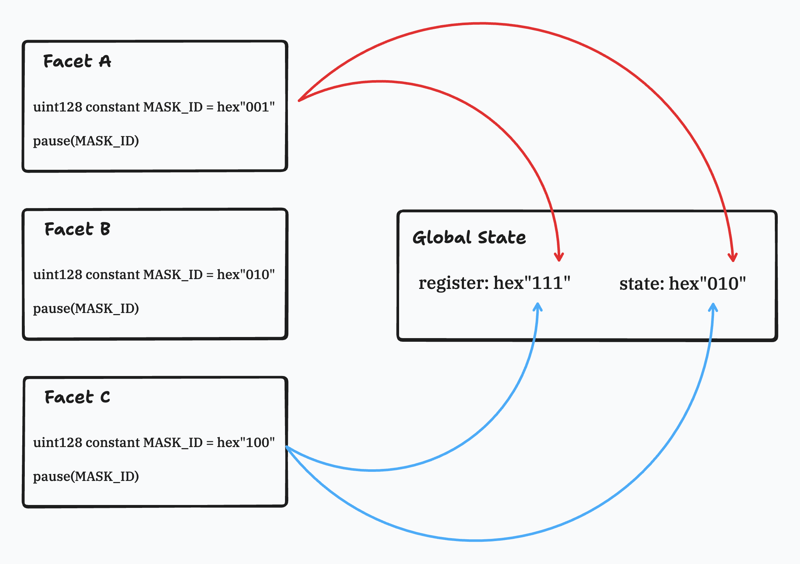

# Partial Pauseable

Partial Pauseable is a diamond-supported contract providing pauseable utilities.

## Rationale

Each facet is defined a MASK_ID that specifies the bits to be manipulated. The actions of 'Pause' and 'Unpause' involve setting or clearing these bits to respectively halt or resume the functionalities.

## Slot

- packing two fields into a single slot:
  - registry: Register a `MASK` to indicate that some of the bits in `STATE` have already been used.
  - state: Record the state of the bits.

| registry | state   |
| -------- | ------- |
| uint128  | uint128 |
